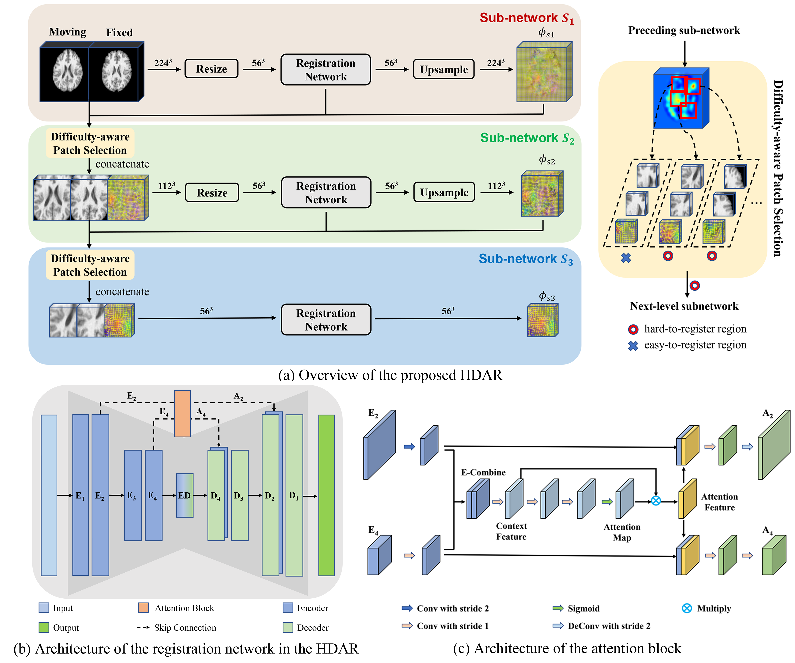
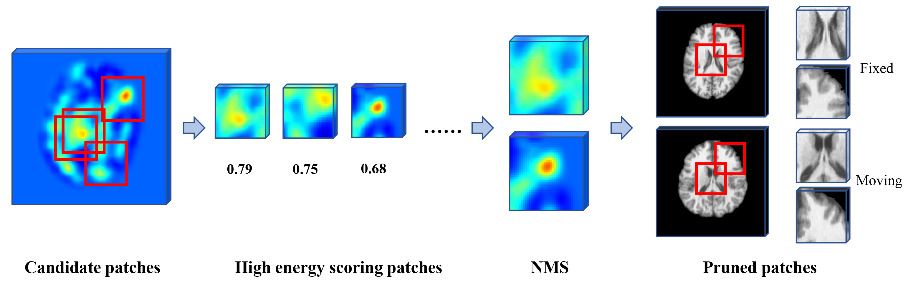
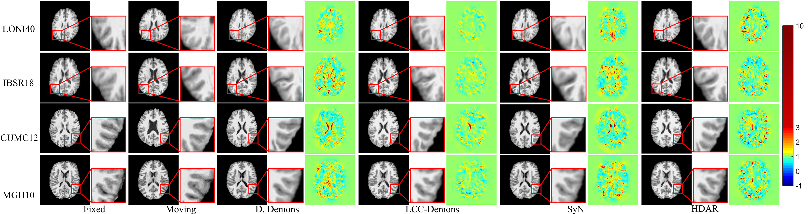
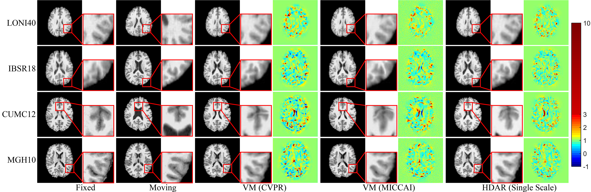

# HDAR: Hierarchical Difficulty-Aware for deformable Registration

## HDAR Framework
We present a difficulty-aware model based on an attention mechanism to automatically identify hard-to-register regions, allowing better estimation of large complex deformations. The difficulty-aware model is incorporated into a cascaded neural network consisting of three sub-networks to fully leverage both global and local contextual information for effective registration. Embedding difficulty-aware learning into the hierarchical neural network allows harder patches to be identified in the deeper sub-networks at higher resolutions for refining the deformation field. Please refer to [our paper](https://www.sciencedirect.com/science/article/pii/S136184152030181X) for more details.



## Difficulty-aware Patch Selection


## Dataset
1. [LONI40](http://www.loni.usc.edu/atlases/Atlas_Detail.php?atlas_id=12)
2. [IBSR18](https://www.nitrc.org/projects/ibsr/)
3. [CUMC12](https://www.synapse.org/#!Synapse:syn3207203)
4. [MGH10](https://www.synapse.org/#!Synapse:syn3207203)

## Comparsion with State-of-the-Art Methods
### Example registration results given by the D. Demons, LCC-Demons, SyN, and HDAR.


### Comparisons with VoxelMorph


## Installation
This code requires Tensorflow-GPU 1.14, TensorLayer 1.10 and Python 3.6.

## Citation
If you use this code for your research, please cite our paper.
```
@article{HUANG2021101817,
title = "Difficulty-aware hierarchical convolutional neural networks for deformable registration of brain MR images",
journal = "Medical Image Analysis",
volume = "67",
pages = "101817",
year = "2021",
issn = "1361-8415",
doi = "https://doi.org/10.1016/j.media.2020.101817",
author = "Yunzhi Huang and Sahar Ahmad and Jingfan Fan and Dinggang Shen and Pew-Thian Yap"
}
```
## Acknowledgments
The source code is inspired by [VoxelMorph](https://github.com/voxelmorph/voxelmorph)
